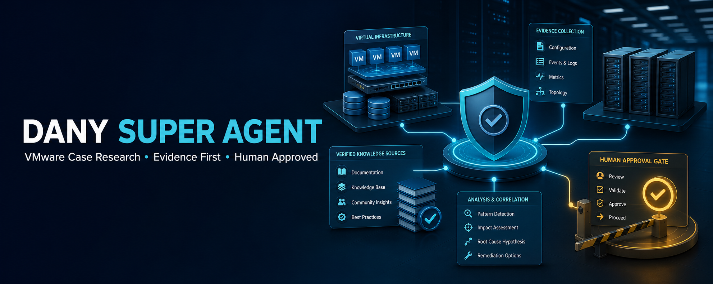

# Dany Super Agent — VMware Case Research Assistant



[](https://github.com/gomadanyvickdistelpika/vmware-case-agent/actions/workflows/tests.yml)  

A privacy-first assistant that turns a VMware support case description or log excerpt into a structured, evidence-led troubleshooting plan — **without guessing a root cause and without touching any infrastructure**.

I built it from 4 years as a VMware by Broadcom Technical Support Engineer handling P1 escalations. The most expensive mistakes in support are rarely "didn't know the fix". They are: declaring a root cause too early, applying a KB article that doesn't match the build, and making a risky change without a rollback plan. This tool is designed to stop those three mistakes.

> **Synthetic data only.** Every example, test case and demo in this repository is synthetic. No customer, employer or production data was used. Not affiliated with VMware or Broadcom.

---

## What it does

Paste a case description or log lines. The **VMware Case Agent** returns:

| Section | Why it matters |
|---|---|
| **Evidence map** (`E1`, `E2`… with line numbers) | Every claim points back to a line you supplied |
| **Ranked hypotheses** — labelled *HYPOTHESIS*, never "root cause" | Keeps observation, inference and assumption separate |
| **Safe checks** — labelled *READ-ONLY* | What you can do right now with zero risk |
| **Risky checks** — labelled *DISRUPTIVE / RISKY — APPROVAL REQUIRED* | Restarts, certificate, identity, storage or lifecycle changes need a human and a rollback |
| **Rollback plan** | Restore steps and abort thresholds before any change |
| **KB applicability gate** | Product and exact version/build must match before a KB is used |
| **Official reference assessment** | Names a Broadcom KB only when the evidence clearly matches — otherwise says so |
| **Customer-ready and internal-note drafts** | Ready-to-edit communication that never over-promises |
| **Confidence + missing evidence** | Tells you what to collect next |

It also recognises 13 VMware log families: `vpxd`, `hostd`, `vmkernel`, `vobd`, `vmafdd`, `vmdird`, `applmgmt`, SSO, Lookup Service, vLCM, EAM, WCP and VAPI.

### Privacy by design

All input passes through deterministic redaction **before** anything is stored: emails, phone numbers, private links, case/SR/ticket IDs, attachment passwords and labelled names. Uploaded files are parsed in memory and never saved. Local memory is **off by default**.

---

## Example (real output)

**Input**

```text
vCenter Server 8.0 U3 - users report intermittent inventory loading failures since 10:00 UTC.
2026-01-15T10:00:00Z vpxd ERROR connection timeout to dependency
2026-01-15T10:00:03Z vmafdd lookup operation failed
Contact: Jane Doe jane@example.com
```

**Output (shortened)**

```text
(UI notice) Redacted before persistence: email, person_name

## Evidence / Verification
- [E1] line 2: 2026-01-15T10:00:00Z vpxd ERROR connection timeout to dependency
- [E2] line 3: 2026-01-15T10:00:03Z vmafdd lookup operation failed

## Ranked hypotheses (not confirmed causes)
1. HYPOTHESIS — component/service degradation
2. HYPOTHESIS — dependency or registration issue: check SSO, Lookup Service, DNS, NTP, certificate chains
3. HYPOTHESIS — resource or environmental pressure

## Risky checks — APPROVAL REQUIRED
- DISRUPTIVE: service restart or failover. Confirm impact and maintenance window first.

## Official reference assessment
- No specific Broadcom KB was verified from the supplied evidence. Collect the missing evidence first.

## Confidence and missing evidence
Confidence: medium
- Issue timeline and impact
- Correlated logs from the same timestamp
```

More: **[10 worked demonstrations](PUBLIC_ISSUE_DEMO.md)** based on recent public vSphere 8 / VCF 9 issue themes. In 4 of them the agent names a verified official KB; in the other 6 it correctly refuses to guess.

---

## How it is evaluated

Quality is enforced by an automated test suite — **36 tests, all passing**:

- **10-case evaluation suite** (`tests/fixtures/case_evaluations.json`): 5 approachable vSphere 8 cases (vMotion network mismatch, datastore latency, host disconnect, VCSA capacity, SSO failure) and 5 difficult vSphere 8 / VCF 9 cases (upgrade precheck sizing, stretched-domain inventory drift, lifecycle image transition, centralised licensing, Supervisor upgrade sequencing). Each case records what the agent *may infer*, what evidence it *must request*, and which unsafe shortcut it *must avoid*.
- **Output contract**: every case must produce all required sections, evidence IDs, confidence, missing evidence, risk labels, approval gates and a rollback plan.
- **Conservative KB matching**: the agent must name a KB only where expected and stay silent where evidence is insufficient.
- **Privacy tests**: names, emails, phones, case IDs, passwords and links are removed.
- **Safety tests**: no workflow executes anything; PC actions stay blocked without approval.

Every Broadcom KB referenced in the code and test data was checked against the live article on 17 Sep 2026.

---

## Run it yourself

Requires Python 3.11+.

```bash
git clone https://github.com/gomadanyvickdistelpika/vmware-case-agent.git
cd vmware-case-agent
python -m venv .venv
# Windows:   .\.venv\Scripts\Activate.ps1
# Mac/Linux: source .venv/bin/activate
pip install -e ".[dev]"
python -m pytest
```

Start the API and the web interface (two terminals):

```bash
python -m uvicorn dany_super_agent.api:app --host 127.0.0.1 --port 8000
python -m streamlit run dany_super_agent/frontend.py
```

Open http://localhost:8501 (UI) or http://127.0.0.1:8000/docs (API).

---

## Architecture

```text
Streamlit UI ──> redaction ──> FastAPI /analyze ──> evidence + policy renderer
                                      │                   └─> official KB matcher (conservative)
                                      ├─> optional redacted SQLite memory (off by default)
                                      └─> local generic knowledge folder
```

| Layer | Tech |
|---|---|
| API | FastAPI, Pydantic |
| UI | Streamlit |
| Storage | SQLite (redacted, local, optional) |
| Tests | pytest |

The engine is **deterministic and rule-based** — no cloud service or model API is needed, and it gives the same answer every time. It is designed as the evidence and safety layer that any future LLM must sit behind.

Other specialist routes (log analysis, customer email, automation suggestions, business, learning, career, documents, device troubleshooting, media, portfolio, and an approval-gated PC-navigation planner) share the same rule: **draft and advise only, never act**.

---

## Honest scope

- **Tested local MVP**, not a production system.
- **Advisory only**: it never connects to vCenter, ESXi or VCF, and never executes a change.
- Official references are **candidates to verify at time of use**, not guaranteed fixes.
- Redaction is defence-in-depth, not a guarantee — do not paste real customer data.
- See [docs/PUBLIC_DEMO_SAFETY.md](docs/PUBLIC_DEMO_SAFETY.md) for the rules any public demo must follow.

## Roadmap

1. Redaction preview before accepting input
2. Support-bundle parsers with file/line/timestamp provenance
3. Official KB connector with build applicability and stale-article warnings
4. Opt-in local LLM adapter behind the deterministic safety gates
5. Stateless public demo (synthetic prompts only, no uploads, no memory)

## How it was built

Designed by me from real support workflow experience, and implemented with AI-assisted development (OpenAI Codex), with every behaviour pinned down by tests.

## Author

**Dany Pika** — Technical Support Engineer (VMware vSphere, VCF, vSAN, NSX) building practical AI tools for support work. Dublin, Ireland.
[LinkedIn](https://www.linkedin.com/in/dany-goma-vyck-distel-pika-8b905b17)

Licensed under the [MIT License](LICENSE).
